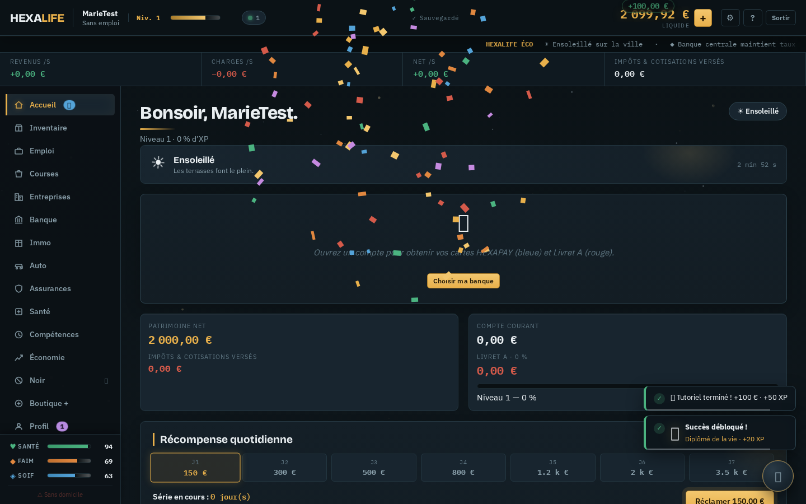

# HEXALIFE 🇫

**Simulateur de vie & d'économie française, en temps réel.**
Créez un citoyen, passez des diplômes, signez un CDI, fondez une boulangerie, une agence
immobilière ou votre propre banque — pendant que 800 citoyens vivent, consomment et font
tourner l'économie autour de vous. Fiscalité française réelle (barème IR 2024, PAS, IS 15 %,
URSSAF), météo vivante, marché noir, succès, récompenses quotidiennes et multijoueur via API.



---

## ✨ Nouveautés de la v11 (refonte complète)

### ✦ v11.8 — Assistant personnel, gammes de qualité, banque maximale
- **Assistant-bulle** (bas droite, débloquable 30 € fictifs) : suggestions **contextuelles**
  selon votre situation (faim basse, entreprise à l'arrêt, Livret vide…), chat avec
  réponses animées (frappe progressive, points de saisie), base de connaissance
  (argent, banque, impôts, B2B, santé, météo, gammes, Stripe…). Ne gêne jamais le site :
  bulle compacte, panneau repliable, toasts/modales déplacés hors des écrans animés.
- **Gammes de qualité par type d'entreprise** : éco / standard / premium avec effets
  réels (prix, demande, réputation, vols). Boulangerie « Artisan premium », magasin
  « Qualité supérieure », immo « Luxe »…
- **Banque (entreprise) : Carte Premium à 1 000 000 €** : ses clients ne paient **plus
  aucun frais de transfert** (vérifié serveur) et gagnent +0,5 % de Livret ; file de
  clients animée au guichet, comptes accélérés.
- **Onglet Banque (client) enrichi** : conseiller financier contextuel, panneau frais
  (0 % si Carte Premium sinon 5 %), courbe d'historique de solde, carte noire si premium.
- **Cohérence multijoueur** : le taux Livret et le statut Premium de votre banque joueur
  sont resynchronisés automatiquement depuis le serveur à chaque visite de l'onglet.
- Bugs corrigés : toasts/modales coincés dans les transforms de transition d'écran
  (déplacés hors des écrans), panneau assistant qui ne s'ouvrait pas au déblocage.

### 🏭 v11.7 — RH obligatoires, postes de direction, contrats B2B
- **Sans salarié, l'entreprise est À L'ARRÊT** (bannière pulsante) : ni production, ni ventes.
- **RH complets** : candidats avec **traits de caractère** (Bosseur, Sympa, Vétéran,
  Flemmard, Malhonnête — effets réels sur production, demande, réputation, coulage de
  caisse), cartes salariés animées, **paie mensuelle** = salaires (h × 100 h) + postes +
  URSSAF 15 % (réduite par le Comptable).
- **Postes de direction par type** (boosts) : Directeur Général (+20 % CA), Service
  Informatique (−30 % vols/incidents), Comptable (−15 % URSSAF) + Chef Boulanger,
  Chef de Rayon, Juriste, Analyste Risques selon l'entreprise.
- **Contrats B2B entre joueurs** : offre (5/10/15/20 % de CA pendant 24 h contre frais),
  acceptation/refus, débit/crédit automatiques via mailbox, boost appliqué en temps réel,
  onglet B2B dédié (contrats actifs avec compte à rebours, offres reçues/envoyées, partenaires).
- **Coûts de création augmentés** : boulangerie 60 k€, magasin 45 k€, immo 150 k€, banque 400 k€.
- Clients réalistes : **panier de 1 à 4 articles** par client, trafic ×1,6.
- Tests : arrêt sans salarié, reprise après embauche, paie exacte via journal, traits,
  postes, purge B2B au sanitize, 100 assertions serveur dont flux B2B complet à 3 joueurs.

### 🏧 v11.6 — vrai distributeur, entreprises vivantes, courses multi-magasins, taxe transferts
- **Distributeur automatique HEXAPAY GAB T-800** (clic sur une carte) : machine complète
  animée — écran phosphore scanlines, **clavier physique** (saisie du montant touche par
  touche), fente CARTE où l'on **insère réellement la carte** (glisser-déposer ou clic),
  LEDs d'activité, **imprimante à tickets** (ticket qui sort à chaque opération),
  **tiroir à billets** (les billets sortent sur retrait), éjection de carte animée.
- **Entreprises enrichies PAR TYPE** :
  - Boulangerie : fraîcheur (pertes quotidiennes réduites par la Chambre froide),
    créneaux d'affluence (matin rush ×1,3…), flux de ventes en direct.
  - Magasin : 2 rayons de plus, **vols en rayon** (vidéosurveillance), contrat fournisseur
    −12 %, et **rayon épicerie vendu aux autres joueurs** (marge réglable, stock réassortable).
  - Immo : rénovations (+20 % commissions/niveau).
  - Banque : réseau de GAB (frais), crédits risqués (+rendement/+défauts).
  - Toutes : panneau **flux en direct** animé, compteurs pertes/vols, chips créneau.
- **Courses multi-magasins** : enseignes PNJ (Hardi Discount −12 %, Market Express +12 %),
  **magasins des joueurs** (leurs prix = leur marge, leur stock vérifié serveur, ils
  encaissent automatiquement) et le vôtre.
- **Taxe de 5 % (min 1 €) sur les transferts joueurs**, affichée en direct dans la modale
  d'envoi et calculée côté serveur (aucune contourne possible).
- Bugs corrigés : boucle de re-render infinie de la liste des magasins, sélecteur de
  magasin ignoré par le moteur en appel direct, ancien overlay terminal résiduel.

### 🎬 v11.5 — intro titre-only, transitions fluides, boutique infalsifiable
- **Intro refaite, simple et hyper stylée** : fond profond à orbes lumineux + grille
  respirante, titre **HEXALIFE** en lettres qui se révèlent (blur + rotation 3D stagger),
  **shine doré clipé sur les glyphes**, soulignement or, tagline, barre de chargement
  minimale, sortie par **wipe circulaire doré**.
- **Connexion / inscription fluides** : bouton → spinner → état succès vert « ✓ Bienvenue… »
  (ou shake + message en cas d'erreur), puis **transition d'écran fluide** (blur + scale
  entrant/sortant) vers le jeu.
- **Boutique sécurisée, plus aucune confirmation manuelle** : le panneau « J'ai payé ? »
  est SUPPRIMÉ (faille d'auto-crédit). Le crédit n'arrive que par **webhook Stripe signé** ;
  sans clés Stripe côté serveur, les paiements sont désactivés et le bouton indique
  « Indisponible » — personne ne peut se donner d'argent.
- Vérification complète : 4 suites de tests repassées au vert après chaque changement.

### 🛡 v11.4 — sécurité, inscription renforcée, intro cinématique, Stripe auto
- **Bug corrigé** : les soldes animés (compte courant / Livret A) *débordaient* de leur case
  (animation scale) → flash couleur/halo sans transform, contenu clipé proprement.
- **Sécurité serveur durcie** : en-têtes CSP / X-Frame-Options / nosniff / COOP / COOP sur
  toutes les réponses ; rate-limiting par IP (auth, transferts, saves, admin, webhooks) ;
  verrou anti brute-force (8 échecs = 15 min) ; sessions 24 octets, plafonnées à 5/compte ;
  validation sanitaire des saves entrantes (bornes cash/xp/livret, tailles de listes) ;
  tokens de session rotatifs ; purge automatique des comptes **inactifs 5 jours**.
- **Inscription renforcée** : mot de passe **8 caractères min. avec majuscule, minuscule et
  chiffre** (politique serveur + jauge de force client), case **CGU obligatoire**, page
  `/cgu.html` dédiée (version datée, acceptation horodatée stockée), œil afficher/masquer.
- **Intro entièrement refaite** : ciel en phases (nuit → aube), étoiles scintillantes,
  soleil levant, immeubles qui poussent, lampadaires qui s'allument en cascade, voitures à
  phares, logo lettre par lettre avec shine, tagline tapée au clavier, barre de chargement
  à étincelle, et **wipe doré** à l'entrée en ville.
- **Boutique : détection automatique du paiement** — si `STRIPE_SECRET_KEY` +
  `STRIPE_WEBHOOK_SECRET` sont configurés : session Checkout créée côté serveur, webhook
  **signé (HMAC)** vérifié, crédit du pack automatique via mailbox (plus besoin de
  « J'ai payé »). Sans clés : repli manuel conservé.
- **Aucune limitation du nombre de sessions/comptes** : connectez-vous depuis autant
  d'appareils que vous voulez (testé : 7 sessions simultanées toutes valides).
- Tests : 82 assertions serveur (webhook signé/invalide, rate-limit 429, CGU, sanity saves,
  sessions illimitées, purge inactifs), smoke (packCredit), navigateur (inscription forte +
  CGU, intro, NFC…).

### ✨ v11.3 — paiement sans contact, tutoriel complet, courbes pro, soldes vivants
- **Paiement sans contact (NFC) sur les gros achats** (formations, voitures, biens,
  créations d'entreprise — pas les courses) : un lecteur apparaît, et **c'est vous qui
  faites glisser la carte à la souris** jusqu'au pad : ondes NFC animées, double bip
  synthétisé, halo vert « ✓ Paiement accepté », puis l'achat s'exécute. Annuler = achat
  abandonné. Sans compte bancaire : paiement immédiat (aucune gêne pour les nouveaux).
  Repli accessible : cliquer le lecteur paie directement ; animations réduites respectées.
- **Tutoriel refondu : 14 étapes** qui **changent d'onglet automatiquement**, scrollent
  la cible au centre, texte enrichi (marché, cartes & terminal, virements, sport, solde
  animé…) ; plus aucun bug de placement ni de ré-armement après fin.
- **Courbes de statistiques pro** : étiquettes min/max, valeur finale, reveal animé au
  premier affichage, double passe lumineuse, et **tooltip + crosshair au survol**.
- **Soldes des cartes & KPI animés en continu** (compte, Livret A, liquide) : tween
  60 fps sans rafraîchissement de page, flash vert/rouge à chaque variation.
- **Compteur haut-droit refait** : défilement fluide permanent + halo directionnel
  (vert = entrées, rouge = sorties) pendant les flux ; jetons de flux en pills lisibles.
- Bugs corrigés : `bal` indéfini dans tickUI, carte NFC hors champ (containing block
  d'animation transform), tutoriel qui se ré-armait, overlay NFC résiduel.

### 💳 v11.2 — système bancaire professionnel & terminal 3D
- **Portefeuille de cartes** cliquables, visibles sur le **tableau de bord** et l'onglet Banque :
  carte **bleue HEXAPAY** (compte courant), carte **rouge LIVRET A**, et **noire PREMIUM**
  (niveau 10 : compte rémunéré 0,5 %/an) — inclination 3D au curseur, reflet balayé.
- **Terminal bancaire HEXAPAY T-800** : clic sur une carte → vol 3D (FLIP) jusqu'au
  lecteur, **insertion animée dans la fente** (rotation + absorption), fente et LED qui
  s'allument, écran phosphore qui s'allume (scanlines, flicker), puis menu d'opérations :
  dépôt espèces, retrait DAB, compte↔Livret A, envoi à un joueur, relevé, échéances,
  plafond, gel/dégel de carte… **Ticket de caisse imprimé** à chaque validation.
- **Gel de carte** (❄) : bloque paiements par carte et mouvements depuis le compte ;
  **plafond par opération** paramétrable ; succès dédiés (Cercle privé, Sang-froid).
- Moteur de virements unifié `moveMoney(from,to,v)` : saisie virgule/espaces acceptée,
  messages indiquant le solde disponible, plafond Livret A et plafond carte respectés.
- Polish « pro » global : zebra sur tableaux, soulignement or des titres, highlights
  internes des panneaux/ boutons, ombre portée fine de la topbar.
- Tests : parcours terminal complet dans Chromium (insertion → virement → ticket →
  éjection) + scénarios gel/plafond/premium/intérêts dans le smoke test.


### 🩹 v11.1 — correctifs de gameplay & contenu par onglet
- **Bug racine corrigé** : les valeurs `data-*` du DOM (chaînes) étaient ignorées par le
  moteur → « ×5 » achetait 1, les boutons ± des prix/taux ne faisaient rien. Tout est
  désormais coercé + **saisie à virgule française acceptée** (« 150,50 »).
- **Banque** : panneau « Mouvements internes » repensé — 4 transferts (liquide↔compte,
  compte↔Livret A) avec solde source affiché, bouton **Max contextuel** par opération,
  boutons désactivés si source vide, messages d'erreur indiquant le disponible ;
  **graphique animé de l'historique de solde**.
- **Courses** : **prix dynamiques du marché** (promos −15/−38 % et tensions +15/35 %,
  refresh ~2 min) avec badges PROMO/+, prix barré, et achat ×5 fonctionnel.
- **Emploi** : **négociation salariale** (+8 % brut/h en cas de succès ; chances selon
  charisme + ancienneté, cooldowns), heures de service affichées.
- **Auto** : **usure des véhicules** (barre d'état), **révision** payante, revente et
  pannes indexées sur l'état — plus de panne de voiture sans voiture.
- **Santé** : **séance de sport** (+4 santé, −4 faim/soif, cooldown 90 s).
- **Entreprises** : **conseiller de prix** par produit (sous/sur le marché), halo
  pulsant sur les cartes sous campagne.
- **Immo** : rendement locatif %/an, plus-values colorées, **graphique du marché immo**.
- **Assurances** : **simulateur de reste à charge** (hôpital, grippe, consultation…).
- **Inventaire** : valeur totale du sac + nombre d'articles.
- **Événements cohérents** : amende stationnement & prime mobilité selon possession de
  voiture ; 3 nouveaux événements.
- **Animations** : effet *ripple* au clic, cœur qui bat sur jauges critiques, badges
  PROMO élastiques, +XP flottant près de la barre de niveau ; correctifs : voiture B de
  l'intro (hors champ), spinner de chargement centré, overlay NIVEAU au-dessus des modales.
- **Régressions verrouillées par tests** : 9 scénarios dédiés dans `test/smoke.mjs`
  (×5, prix, taux, Livret A virgule + Max, négociation, sport, révision, marché, amende).


### 🎬 Animations — beaucoup plus nombreuses, beaucoup plus fines
- **Moteur canvas dédié (`js/fx.js`)** : météo ambiante (pluie, neige, poussière dorée de
  canicule, braises de chaleur), étoiles scintillantes, confettis à physique réelle
  (gravité, traînée, rotation), pluie de billets, billets volants, étincelles.
- **Graphiques animés** : courbes lissées (splines) avec dégradé, point final pulsant,
  *morphing* fluide entre jeux de données — indices, performance nette, revenu d'entreprise.
- **Overlay « NIVEAU X »** : rayons rotatifs, anneau expansif, pop élastique + confettis.
- **Flash d'événement** plein écran (liseré doré/rouge), secousse d'écran (hôpital, arrestation).
- **Carte bancaire HEXAPAY 3D** qui suit le curseur (inclinaison perspective) + reflet balayé.
- **Micro-interactions partout** : boutons à reflet glissant, cartes qui se soulèvent,
  jauges à shimmer, badges pulsants, compteurs qui « bumpent », toasts avec barre de vie,
  modales élastiques, transitions d'onglets, apparition en cascade des panneaux.
- **Intro cinématique enrichie** : nuages dérivants, voitures à phares allumés, fenêtres
  qui s'allument et clignotent, aube progressive pilotée par le chargement.
- **Respect de `prefers-reduced-motion`** + réglage « animations réduites ».

### 🔊 Audio
- **Sons synthétisés WebAudio** (aucun fichier) : achats, ventes, niveaux, succès, sirène de
  garde à vue, cloche… Désactivables dans ⚙ Réglages.

### 🎮 Fonctionnalités ajoutées
- **30 succès** débloquables (toast dédié + XP + grille complète dans le Profil).
- **Récompense quotidienne** à séries (J1 → J7, jusqu'à 3 500 €), calendrier animé.
- **Classement de la ville** (API) : top 10 par patrimoine, votre rang, joueurs en ligne.
- **Caution de garde à vue** : sortez de prison immédiatement contre 10 % du solde.
- **Météo ↔ gameplay** : canicule = soif ×1,7 ; pluie/neige sans domicile = santé en baisse ;
  soleil = récupération accrue. Multiplicateurs d'entreprises selon la météo.
- **Journal de compte filtrable** (tout / entrées / sorties) avec icônes par type.
- **Alertes de stock épuisé** pour vos commerces, commandes spéciales mieux signalées.
- **Réglages** (sons / particules / animations réduites) + **modale d'aide** (F1).
- **Raccourcis clavier** : `Échap` fermer · `Alt+1..9` onglets · `F1` aide.
- **Contenu étendu** : 2 entreprises, 3 aliments, 2 voitures, 1 bien immobilier, 2 formations,
  10 événements et 10 brèves de ticker en plus.
- **Progression hors-ligne détaillée** : salaires, entreprises, loyers, intérêts Livret A.

### 🐞 Bugs corrigés (extraits de l'audit)
- `sanitize()` **crashait sur les sauvegardes corrompues** (`vitals: null`, tableaux invalides…)
  → fusion profonde typée et bornée ; migration v10 → v11 automatique.
- `A.offer`, `A.buyCar`, `A.craft`… **crashaient sur indices hors bornes** → tous validés.
- **Ops mailbox re-jouées en boucle** si l'une échouait → application isolée + ack garanti.
- **Modale banque jamais fermée** après ouverture de compte (`openBank`).
- Intro **bloquée à 14 %** si l'API ne répondait pas → timeouts internes + garde-fou 4 s.
- Boutons de connexion/inscription **gelés** sur erreur réseau → `try/finally` + messages.
- `fireEvent` crashait si le pool d'événements était vide → repli sûr.
- Historiques d'indices collectés **seulement sur l'onglet Économie** → désormais toujours
  (graphiques vivants dès l'ouverture) + historique pré-généré au lancement.
- Ticker **statique** → reconstruit toutes les 45 s avec données vivantes.
- Annonces vues dédupliquées **par navigateur** au lieu de **par joueur** → clé scopée.
- Re-render complet toutes les 5 s de l'onglet Marketing → comptes à rebours génériques
  `[data-until]` mis à jour sans re-render.
- `moneyFx` spammait un jeton par opération → **agrégation** toutes les 420 ms.
- Sauvegarde de fermeture d'onglet parfois perdue → `navigator.sendBeacon`.
- **Sécurité serveur** : `server/hexalife.db` (hachés de mots de passe + saves) était
  téléchargeable en HTTP → dossier `server/`, `test/` et fichiers cachés désormais interdits ;
  écriture atomique de la base ; sessions expirantes (30 j) ; corps de requête borné (413) ;
  comparaison de hachés à longueur constante ; résolution de pseudo insensible à la casse
  pour les transferts ; réservations (holds) persistées contre le double envoi.

### 🧪 Qualité — le projet est testé
- `npm test` lance **3 suites** :
  - `test/smoke.mjs` — le vrai client dans jsdom : 400+ ticks, 15 onglets, ~120 actions,
    sauvegardes corrompues, offline, FX… zéro exception tolérée.
  - `test/server.test.mjs` — **70 assertions API** : comptes, transferts, holds, annonces,
    banques joueurs, classement, admin, sécurité statique.
  - `test/browser.test.mjs` — session complète dans **Chromium headless** (inscription,
    tutoriel, achats, contrat, banque, entreprise, mobile…) + captures `screenshots/`.

---

## 🚀 Démarrer

```bash
npm install        # aucune dépendance runtime ! (Node ≥ 18 suffit)
npm start          # → http://localhost:3000
```

Sans serveur, `index.html` fonctionne aussi en **mode local** (base navigateur) :
tout le solo est jouable, seul le multijoueur (transferts, annonces, classement) nécessite l'API.

### Variables d'environnement serveur
| Variable | Rôle |
|---|---|
| `PORT` | port d'écoute (défaut 3000 — fourni automatiquement par Render) |
| `ADMIN_NAME` | pseudo disposant du panneau admin |
| `DB_PATH` | dossier du fichier `hexalife.db` (persistant) |
| `UPSTASH_REDIS_REST_URL` / `UPSTASH_REDIS_REST_TOKEN` | base Redis partagée (Render, etc.) |
| `API_DISABLED=1` | couper l'API (statique seul) |

### 🚢 Déployer sur Render + Upstash (testé, cf. `npm run test:upstash`)
1. **Upstash** : créez une base Redis (plan gratuit), copiez l'**URL REST** et le **token**
   (console Upstash → votre base → onglet REST API).
2. **Render** : New → **Web Service** → votre dépôt GitHub.
   - **Root Directory** : vide (racine du dépôt)
   - **Runtime** : Node
   - **Build Command** : vide (aucune dépendance) — ou `npm install`, instantané
   - **Start Command** : `node server/server.js` (strictement équivalent à `npm start`)
   - **Node version** : épinglée par `.nvmrc` (20) — sinon env var `NODE_VERSION=20`
   - Variables d'environnement : `UPSTASH_REDIS_REST_URL`, `UPSTASH_REDIS_REST_TOKEN`,
     `ADMIN_NAME` (votre pseudo). `PORT` est injecté par Render.
   - Health check (optionnel) : `/api/health`
3. **Migration automatique** : si votre base Upstash contient déjà des données de
   l'ancienne version, elles sont migrées au démarrage (sessions chaîne → objet,
   champs `holds`/`mailbox` créés) et les sauvegardes `v10` des joueurs sont
   converties en `v11` côté client à la connexion — **personne ne perd sa vie**.
   Vérifié par `test/upstash.test.mjs` (16 assertions, dont un redémarrage complet
   simulant un redeploy).
4. **Sans Upstash** : repli sur fichier local — fonctionne, mais le disque des
   instances gratuites Render est éphémère (redéploiement = remise à zéro).
   Upstash est donc fortement recommandé en production.
5. Instance gratuite Render = veille après 15 min d'inactivité : le premier chargement
   peut prendre quelques secondes ; l'intro attend la détection de base sans jamais
   bloquer (timeout 3 s + garde-fou 4 s).

### Tests
```bash
npm test           # smoke client + intégration serveur
npm run test:client
npm run test:server
node test/browser.test.mjs   # navigateur réel (playwright-core + chromium)
npm run check      # vérification syntaxique de tous les modules
```

---

## 🗂 Architecture

```
index.html          écrans intro / auth / jeu + calques canvas FX
css/style.css       design system complet (tokens, animations, responsive)
js/db.js            couche base : API serveur ↔ repli localStorage, sendBeacon
js/data.js          données pures (emplois, recettes, succès, événements…) — AJOUTS ONLY
js/fx.js            moteur FX : canvas météo/particules, sons WebAudio, graphiques
js/engine.js        boucle de jeu (1 tick/s = 1 min), économie, fiscalité, sanitize v11
js/ui.js            rendu, vues, toasts, modales, tutoriel, présence réseau
js/main.js          boot, intro, délégation clics, raccourcis, erreurs globales
server/server.js    API Node sans dépendance : comptes, saves, transferts, annonces,
                    banques joueurs, classement, admin, statique sécurisé
test/               smoke jsdom, intégration API, session Chromium + captures
```

**Boucle de jeu** : 1 tick = 1 s réelle = 1 minute de vie ; 60 ticks = 1 mois
(loyers, charges, intérêts, URSSAF, IS). Les entreprises tournent en continu
(demande, réputation, prix, météo, marketing, salariés).

**Sauvegardes** : versionnées (`v: 11`), migrées automatiquement, assainies à la lecture —
une sauvegarde ancienne ou abîmée ne peut plus faire crasher le jeu.

## 🎯 Jouer vite fait
1. **Courses → Inventaire** : mangez avant que la faim ne tombe à 0.
2. **Emploi** : une formation (gratuite : « Remise à niveau ») puis un contrat partiel.
3. **Banque** : ouvrez un compte — salaires, impôts et transferts y passent.
4. **Entreprises** : boulangerie = production artisanale ; magasin = négoce ;
   agence immo = mandats ; banque = pilotage de taux et clients joueurs.
5. **Accueil** : défis, quêtes, récompense quotidienne, loto.
6. **Noir** 🔒 : rentable, mais la chaleur monte… et la caution aussi.

## 📄 Licence
MIT — amusez-vous, et vivez bien. 💛
